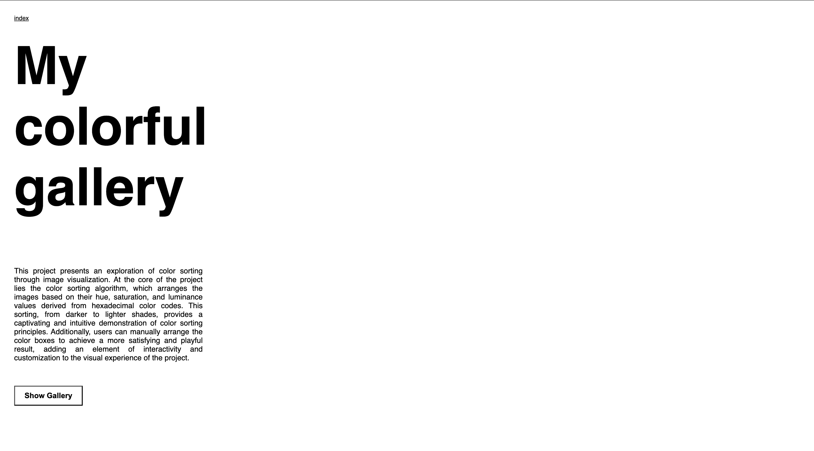
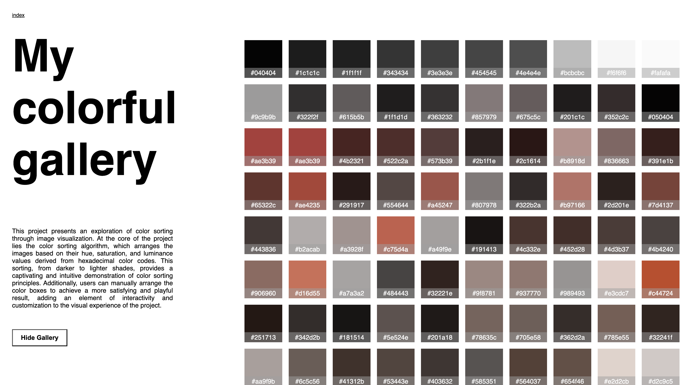
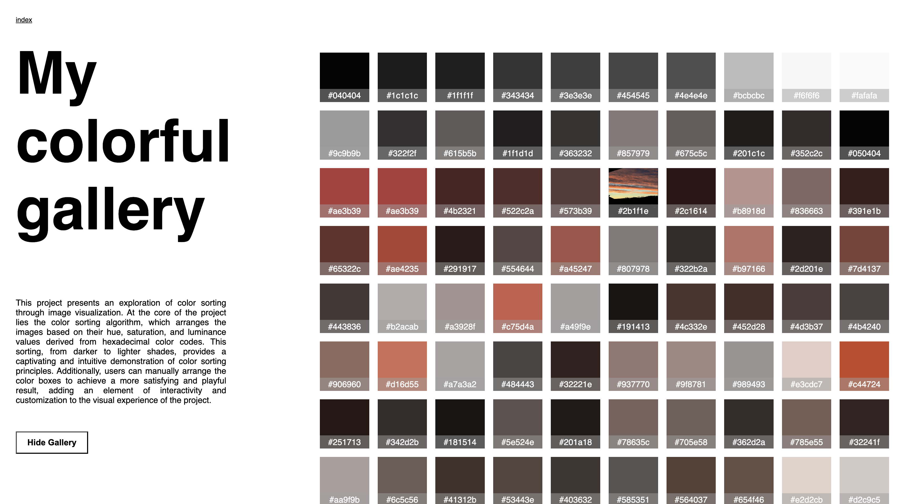

SUPSI 2023-24  
Corso d’interaction design, CV427.01  
Docenti: A. Gysin, G. Profeta  

Elaborato 3: My colorful gallery 

# My colorful gallery
Autore: Margherita Lavagnini  
[MediaPipe demo-ES6](https://margheritalavagnini.github.io/my_colorful_gallery/)

## Introduzione e tema
Il progetto “My colorful gallery” è un’innovativa visualizzazione di immagini che esplora il concetto di ordinamento dei colori. Questa pagina web presenta una serie di immagini organizzate in una griglia, ognuna delle quali appare su uno sfondo che corrisponde al suo colore principale. L'interazione dell'utente è arricchita da un effetto di transizione: quando si passa il mouse su un’immagine, questa diventa visibile, rivelando il suo contenuto.
Il fulcro del progetto è l’algoritmo di ordinamento dei colori. Le immagini vengono ordinate in base alla tonalità, saturazione e luminanza del loro colore principale, calcolate a partire dal formato esadecimale del colore. Questo ordinamento offre una visualizzazione affascinante e intuitiva del concetto di ordinamento dei colori.
Le immagini utilizzate nel progetto sono caricate da un file JSON, che contiene informazioni sul colore principale di ciascuna immagine. Questo metodo consente di gestire facilmente grandi set di immagini e di aggiornare la visualizzazione in modo dinamico.

## Riferimenti progettuali
Per questo progetto, mi sono ispirata alla visualizzazione cromatica utilizzata da Pantone nelle sue campagne. Pantone, attraverso una rappresentazione cromatica distintiva, promuove le bellezze naturali e culturali, suscitando il mio interesse per l'uso creativo del colore nella comunicazione visiva. Il loro modo di catturare l'essenza e l'identità di un luogo attraverso una palette di colori accuratamente selezionata ha stimolato la mia curiosità e il desiderio di esplorare approcci simili nel mio progetto.
L'idea di utilizzare il colore come veicolo per trasmettere un senso di luogo e di esperienza mi ha affascinato. Osservando come Pantone traduce la bellezza e la diversità dei luoghi in una gamma di tonalità cromatiche, mi sono chiesta come potessi applicare concetti simili alla mia galleria di immagini. La capacità di catturare l'atmosfera e l'emozione di un luogo attraverso la scelta dei colori mi ha spinto a esplorare come reinterpretare visivamente le mie immagini, enfatizzando le sfumature e le tonalità che le definiscono.

## Design dell’interfraccia e modalià di interazione
Il sito web presenta un titolo "My colorful gallery" su uno sfondo bianco. Gli utenti tramite un tasto posizionato in basso a sinsitra possono mostrare la visualizzazione della galleria; uno scroll verticale permette di visualizzare tuttle immagini sottoforma di palette colori, ma passando sulle caselle, con un effetto mouseover vengono mostrate le immagini. È presente una sola pagina su cui l'utenete puo muoversi. 

## Tecnologia usata
Il codice HTML e JavaScript fornito mostra l'implementazione di un'applicazione web per la visualizzazione e l'ordinamento delle immagini in base alla luminosità, saturazione e tinta dei colori presenti in ciascuna di esse.
Il codice JavaScript fornisce la logica dietro il funzionamento dell'applicazione. Utilizzando fetch(), il codice accede a un file JSON contenente i dati delle immagini e delle loro palette cromatiche. Successivamente, le immagini vengono ordinate in base alla tinta, saturazione e luminosità dei colori utilizzando le funzioni hexToHue(), hexToSaturation() e rgbToLum(). Infine, viene generato il markup HTML dinamicamente per visualizzare le immagini e le loro palette cromatiche all'interno dell'elemento main della pagina.
Mentre invece per qunato riguarda i dati delle immagini e delle loro palette cromatiche essi sono memorizzati in un file JSON, che viene caricato tramite fetch() per essere utilizzato nell'applicazione.

Una parte che mi ha particolarmente interessata è stata la sezione dediacta all'ordinamento dei colori della galleria e del passaggio dei colori da stringa a RGB: 

function hexToRgb(hex) {
            const result = /^#?([a-f\d]{2})([a-f\d]{2})([a-f\d]{2})$/i.exec(hex);
            return {
                r: parseInt(result[1], 16),
                g: parseInt(result[2], 16),
                b: parseInt(result[3], 16)
            };
        }

        function hexToHue(hex) {
            let { r, g, b } = hexToRgb(hex);
            r /= 255;
            g /= 255;
            b /= 255;
            const max = Math.max(r, g, b);
            const min = Math.min(r, g, b);
            let h;

            if (max === min) {
                h = 0; // achromatic
            } else {
                const d = max - min;
                switch (max) {
                    case r: h = (g - b) / d + (g < b ? 6 : 0); break;
                    case g: h = (b - r) / d + 2; break;
                    case b: h = (r - g) / d + 4; break;
                }
                h /= 6;
            }

            return h * 360;
        }

        function hexToSaturation(hex) {
            let { r, g, b } = hexToRgb(hex);
            r /= 255;
            g /= 255;
            b /= 255;
            const max = Math.max(r, g, b);
            const min = Math.min(r, g, b);

            let s;
            if (max === min) {
                s = 0; // achromatic
            } else {
                const l = (max + min) / 2;
                s = l > 0.5 ? (max - min) / (2 - max - min) : (max - min) / (max + min);
            }

            return s;
        }

        function rgbToLum(rgb) {
            const R = rgb.r / 255;
            const G = rgb.g / 255;
            const B = rgb.b / 255;
            
            return 0.299 * R + 0.587 * G + 0.114 * B;

## Target e contesto d’uso
 "My colorful gallery" si presenta come uno strumento innovativo e versatile che unisce creatività e tecnologia, offrendo agli utenti la possibilità di esplorare e apprezzare le immagini in modo creativo e informativo attraverso l'analisi delle loro caratteristiche cromatiche. Dunque questo sito è rivolto a chiunque sia interessato a visualizzare le proprie immagini sotto forma di palette cromatica e anche a chi piace ordinare compulsivamente i colori ;).
